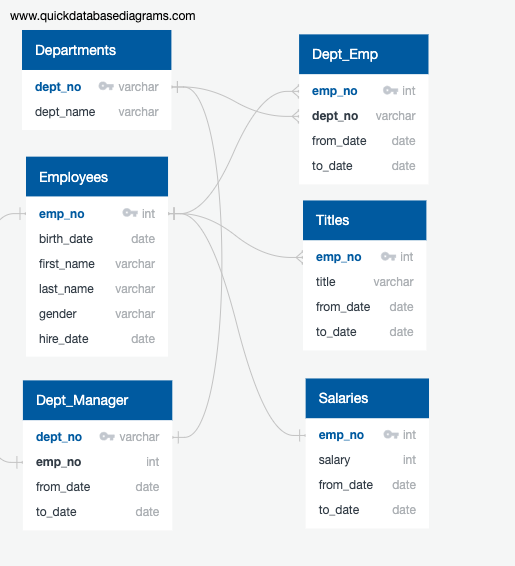
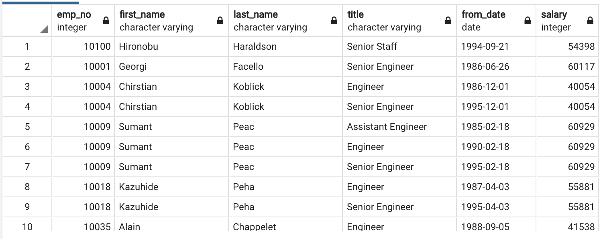
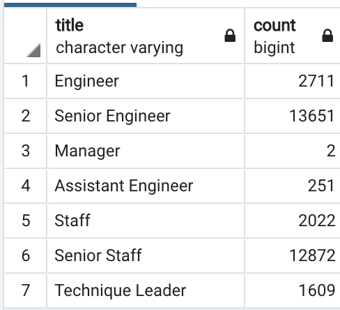
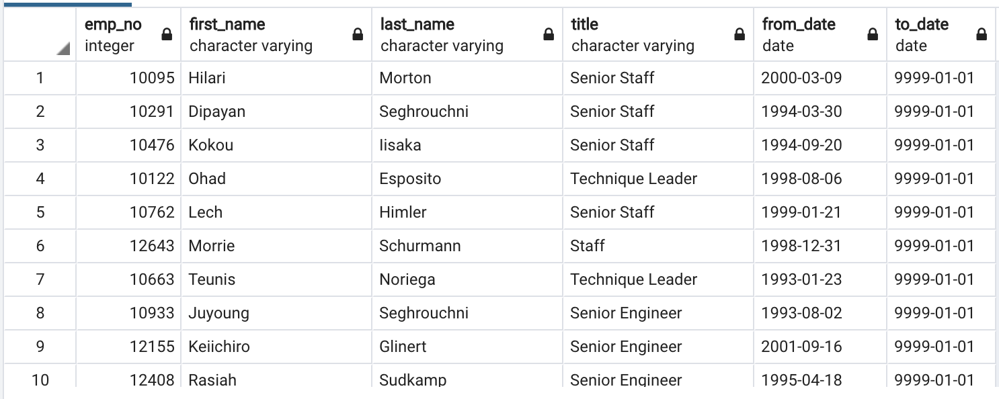

# Pewlett-Hackard-Analysis
This project has a goal of searching through databases to generate a list of potential candidates for retirement, counting the number of potential retirees for each title, and coming up with a list with potential mentor candidates who were born in year 1965.

To start, we had six CNV files with some overlapping key values. The relationship among the CNV files are shown in the following ERD figure. 

-

The first query was to generate a table with potential candidates for retirement, along with their salary and title info. The following code was used for the requested query.

```SQL
-- Generate potential retirees table with titles
SELECT e.emp_no,
	e.first_name,
	e.last_name,
	ti.title,
	ti.from_date,
	s.salary
INTO retiring_titles
FROM employees as e
INNER JOIN salaries as s
ON (e.emp_no = s.emp_no)
INNER JOIN titles as ti
ON (e.emp_no = ti.emp_no)
INNER JOIN dept_emp as de
ON (e.emp_no = de.emp_no)
WHERE (e.birth_date BETWEEN '1952-01-01' AND '1955-12-31')
AND (e.hire_date BETWEEN '1985-01-01' AND '1988-12-31')
AND (de.to_date = '9999-01-01');
```
And here is the top rows of the returned table from the above query. 


While this table lists all the current employees fitting the retirement category, it lists duplicate values for individuals who have changed titles during their career with PH. In order to remove duplicate values and keep the most recent titles, the above table was partitioned using the following code. After removing duplicate values, the frequency of each title was counted.

```SQL
-- Keep the most recent titles from the retiree table
SELECT emp_no, first_name, last_name, title, from_date, salary 
INTO recent_titles
FROM
	(SELECT emp_no, first_name, last_name, title, from_date, salary, ROW_NUMBER()
	 OVER
	(PARTITION BY emp_no ORDER BY from_date DESC) rn
	 FROM retiring_titles) tmp 
	 WHERE rn =1;
-- Count title frequency among retirees
SELECT title, count(*) 
INTO title_counts
FROM recent_titles
GROUP BY title;
```

The following table is the result from the above code. Among the 33,118 candidate retirees, the majorities were "Senior Engineer" or "Senior Staff". After this process, we have a better idea of which positions will need to be replaced in the near future. Possibly, some promotions can help fill the "Senior" titled roles, in addition to new hires. 

-

Finally, we were asked to generate a list of mentor candidates. The criteria was current employees that were born in 1965. For this, the following code was used for query. 

```SQL
-- Generate mentor list 
SELECT e.emp_no, e.first_name, e.last_name, ti.title, ti.from_date, ti.to_date
INTO mentor_list
FROM employees as e
RIGHT JOIN titles as ti
ON (e.emp_no = ti.emp_no)
WHERE (e.birth_date BETWEEN '1965-01-01' AND '1965-12-31')
AND (ti.to_date = '9999-01-01');
```

And here is the list of mentor candidates. 

-

The list contains 1549 mentor candidates that were born in 1965. 

Assuming not all of mentor candidates can be promoted, we can possibly do some further analysis to prioritize the list. As the majority of the employees eligible for retirement are "Senior Engineer" or "Senior Staff", we can further filter the mentor list to narrow down the list specific to the titles "Engineer" and/or "Staff". Among them, employees with good performance can be the ones to be promoted to senior roles. 

Altogether, we show a series of analysis in this project to find retirement candidates and info on the titles of those candidates to get a guidance in future promotion or new hires happening in the company. Through the last analysis, we find candidates ready to be promoted to senior roles. Using this list with the title info from the previous analysis, the company will have a better sense of whom to promote for senior/mentorship roles. 

    
